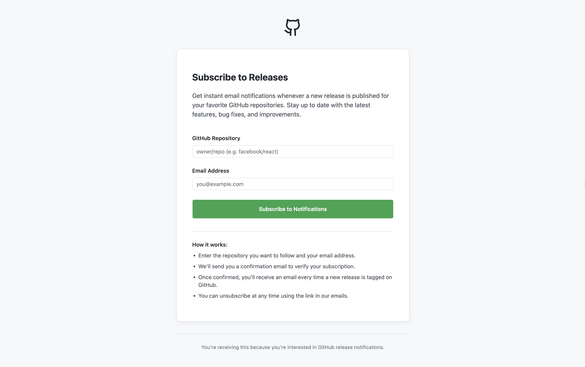
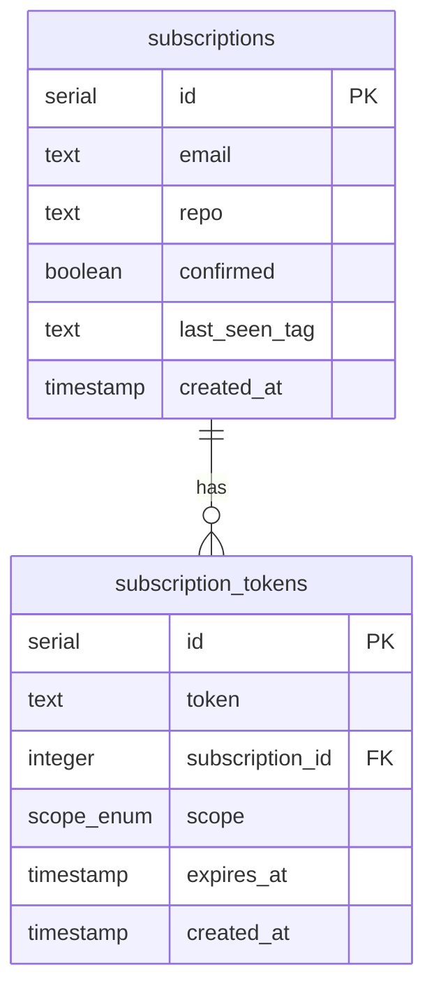

# GitHub Release Notification API

[](https://github.com/artemmatiushenko1/github-release-notifier/actions/workflows/ci.yaml)



A monolith service that allows users to subscribe to email notifications about new releases of any public GitHub repository.

## Features

- **Subscription Management**: Subscribe, confirm, and unsubscribe from repository release notifications.
- **Automated Scanning**: Periodically checks for new releases using a cron job.
- **Email Notifications**: Sends formatted emails when a new release is detected.
- **GitHub API Integration**: Validates repository existence and fetches the latest release data.
- **Caching**: Redis-based caching for GitHub API responses to respect rate limits (10-minute TTL).
- **Monitoring**: Prometheus metrics for tracking system health, scanner performance, and cache efficiency.
- **API Documentation**: Integrated Swagger UI for interactive API exploration.
- **Modern Tech Stack**: Built with Fastify, TypeScript, Drizzle ORM, and PostgreSQL.

## Client Application

The service includes a built-in React-based frontend to provide a user-friendly experience for managing subscriptions. When the server is running, you can access the following pages:

- **Subscription Page (`/`)**: The main landing page where users can enter their email and a GitHub repository path to subscribe.
- **Confirmation Page (`/confirm/:token`)**: The page users land on after clicking the link in their confirmation email to activate their subscription.
- **Unsubscribe Page (`/unsubscribe/:token`)**: A dedicated page for users to easily opt-out of notifications using their unique token.
- **Success Page (`/sent`)**: A feedback page shown after a successful subscription request, instructing the user to check their email.

## Business Logic

The service operates on two core processes: **Subscription Management** and **Automated Release Scanning**.

### 1. Subscription Lifecycle

- **Subscription Request**: Validates email and repository path (`owner/repo`). It checks repository existence via GitHub API and ensures no duplicate subscriptions exist. A pending subscription and secure tokens (confirm/unsubscribe) are created, and a confirmation email is sent.
- **Confirmation**: Upon clicking the link, the subscription becomes active, and an initial scan is triggered to capture the current `last_seen_tag`. This ensures users only receive notifications for _future_ releases.
- **Unsubscription**: Users can opt-out at any time using a unique token provided in every email.

### 2. Automated Release Scanning

- **Scheduled Scans**: A cron job (default: every 10 minutes) triggers the scanner for all confirmed subscriptions.
- **Change Detection**: The scanner fetches the latest release from GitHub and compares it with the `last_seen_tag` in the database.
- **Notification**: If a new tag is detected, the service sends an email to the subscriber and updates the `last_seen_tag` to prevent duplicate alerts.
- **Rate Limit Handling**: The service gracefully handles GitHub API rate limits (HTTP 429) and uses Redis caching to minimize redundant API calls.

## Tech Stack

- **Runtime**: Node.js (v22+)
- **Language**: TypeScript
- **Web Framework**: Fastify
- **Database**: PostgreSQL
- **ORM**: Drizzle ORM
- **Cache**: Redis (ioredis)
- **Validation**: Zod
- **Metrics**: Prometheus (prom-client)
- **Email**: Nodemailer
- **Testing**: Vitest
- **Scheduling**: node-cron
- **API Client**: Octokit

## Getting Started

### Prerequisites

- Docker and Docker Compose
- A GitHub Personal Access Token (optional, but recommended to avoid rate limits)
- A Gmail account with OAuth2 credentials (for sending emails)

### Environment Setup

1. Copy the example environment file:
   ```bash
   cp .env.example .env
   ```
2. Fill in the required variables in `.env`:
   - `DATABASE_URL`: PostgreSQL connection string.
   - `REDIS_URL`: Redis connection string.
   - `GITHUB_TOKEN`: Your GitHub PAT.
   - `GMAIL_USER_EMAIL`: Your Gmail address.
   - `GMAIL_CLIENT_ID`, `GMAIL_CLIENT_SECRET`, `GMAIL_REFRESH_TOKEN`: Your Google OAuth2 credentials.

### Running with Docker (Recommended)

The easiest way to run the entire system is using Docker Compose:

```bash
docker compose up --build
```

Once the containers are running, the application will be accessible at:

- **Web Interface**: [http://localhost:3000](http://localhost:3000)
- **API Documentation (Swagger)**: [http://localhost:3000/api/docs](http://localhost:3000/api/docs)
- **Prometheus Metrics**: [http://localhost:3000/metrics](http://localhost:3000/metrics)
- **Prometheus UI**: [http://localhost:9090](http://localhost:9090) (scrapes the app `/metrics` endpoint)
- **Grafana**: [http://localhost:3001](http://localhost:3001) (default login `admin` / `admin`, Prometheus datasource preconfigured)

### Structured Logging & Elasticsearch (Optional)

The API emits **structured JSON logs** (Pino) to stdout with fixed fields (`service`, `env`, `requestId` on HTTP requests). By default, logs are available via `docker logs app`.

To ship logs to **Elasticsearch** and explore them in **Kibana**, start the optional logging profile (requires ~2GB Docker memory for Elasticsearch):

```bash
docker compose --profile logging up --build -d
```

| Service | URL | Purpose |
|---------|-----|---------|
| Elasticsearch | [http://localhost:9200](http://localhost:9200) | Log storage (auth required) |
| Kibana | [http://localhost:5601](http://localhost:5601) | Log search UI |

**Credentials** (see `.env.example`):

- **Kibana UI login:** username `elastic`, password `ELASTIC_PASSWORD` (default: `changeme`)
- **Elasticsearch API / Filebeat:** same `elastic` credentials
- Kibana connects to Elasticsearch internally as `kibana_system` (configured automatically by the `elasticsearch-setup` service)

If you previously ran Elasticsearch with security disabled, reset its data volume before starting with security enabled:

```bash
docker compose --profile logging down
docker volume rm $(docker volume ls -q --filter name=elasticsearch_data)
docker compose --profile logging up -d
```

**Environment variables** (see `.env.example`):

- `LOG_LEVEL` — Pino log level (`info` default)
- `LOG_PRETTY` — Human-readable logs in local dev only; keep `false` in Docker so Filebeat can parse JSON
- `ELASTIC_PASSWORD` — Elasticsearch superuser password (`elastic` user; Kibana UI login)
- `KIBANA_SYSTEM_PASSWORD` — internal password for Kibana’s Elasticsearch connection
- `KIBANA_ENCRYPTION_KEY` — Kibana saved-object encryption key (min 32 characters)

**Verify the pipeline:**

1. Check Elasticsearch: `curl -u elastic:changeme http://localhost:9200/_cat/indices?v`
2. Generate traffic: `curl http://localhost:3000/health`
3. Inspect raw JSON logs: `docker logs app`
4. Log in to Kibana at [http://localhost:5601](http://localhost:5601) with `elastic` / your `ELASTIC_PASSWORD`
5. Create a data view:
   - Direct link: [http://localhost:5601/app/management/kibana/dataViews/create](http://localhost:5601/app/management/kibana/dataViews/create)
   - Or: **☰ → Stack Management → Data views → Create data view**
   - If you see "First, you need data", click **create a data view against hidden, system or default indices** at the bottom of that page
   - Index pattern: `github-release-notifier-*`, timestamp field: `@timestamp`
6. Open **Discover**, select the data view, and filter on fields such as `level`, `msg`, `email`, `repo`, `requestId`

Filebeat reads the `app` container logs from the Docker engine and indexes them daily (`github-release-notifier-YYYY.MM.DD`). Elasticsearch uses HTTP with authentication enabled and TLS disabled for local development.

**Example Kibana queries (KQL in Discover):**

```kql
# HTTP access logs
msg: "request completed"
msg: "request completed" and path: "/health"
msg: "request completed" and statusCode >= 400

# Business events
msg: "User subscribed"
msg: "New release detected" and repo: "owner/repo"

# Errors (Pino level 50)
level: 50

# Trace one request
requestId: "your-uuid-here"
```

> **Note:** Pino's `url` and `service` fields are renamed to `path` and `app_name` before indexing because the Filebeat ECS template maps `url` and `service` as objects. Without this rename, Elasticsearch rejects log lines and Filebeat reports dropped events.

If Filebeat was reconfigured, reset the data stream so field mappings stay consistent:

```bash
curl -X DELETE -u elastic:changeme 'http://localhost:9200/_data_stream/github-release-notifier-*'
docker compose --profile logging restart filebeat
curl http://localhost:3000/health
```

Restart Filebeat after config changes: `docker compose --profile logging restart filebeat`.

> **Note:** E2E tests (`docker-compose.e2e.yaml`) do not start the ELK stack to keep CI fast.

### Running Locally

1. Install dependencies:
   ```bash
   npm install
   ```
2. Start the development server (requires local Postgres and Redis):
   ```bash
   npm run dev
   ```

## Logging

Application logs use **Pino** via Fastify with a domain `Logger` adapter. Each log line includes:

- `service`: `github-release-notifier`
- `env`: `development` | `production` | `test`
- `requestId`: correlates all logs for a single HTTP request (also returned as `x-request-id` response header)

Domain services log structured context (e.g. `email`, `repo`, `subscriptionId`) instead of interpolated strings, which makes filtering in Kibana straightforward.

For local development without Docker, optional pretty printing:

```bash
LOG_PRETTY=true npm run dev
```

## Monitoring & Metrics

- **Metrics Endpoint**: `http://localhost:3000/metrics`
- **Prometheus** (Docker): `http://localhost:9090` — targets `app:3000/metrics` on the Compose network
- **Grafana** (Docker): `http://localhost:3001` — Prometheus datasource at `http://prometheus:9090` (provisioned on startup)

### HTTP RED metrics

The API exposes [RED](https://www.weaveworks.com/blog/2014/06/the-red-method-key-metrics-for-microservices-architecture) (Rate, Errors, Duration) metrics for every HTTP request:

| Metric | Type | Labels | RED signal |
|--------|------|--------|------------|
| `http_server_requests_total` | Counter | `method`, `route`, `status_code` | **Rate** and **Errors** |
| `http_server_request_duration_seconds` | Histogram | `method`, `route` | **Duration** |

`route` uses the Fastify route template (e.g. `/api/confirm/:token`) to avoid high cardinality from tokens in URLs.

**Example PromQL:**

```promql
# Request rate by route
sum(rate(http_server_requests_total[5m])) by (route, method)

# 5xx error rate
sum(rate(http_server_requests_total{status_code=~"5.."}[5m]))
  / sum(rate(http_server_requests_total[5m]))

# p95 latency by route
histogram_quantile(0.95,
  sum(rate(http_server_request_duration_seconds_bucket[5m])) by (le, route)
)
```

### Business & batch metrics

- `subscription_requests_total`: Total number of subscription attempts.
- `notifications_sent_total`: Total number of emails sent.
- `scanner_runs_total`: Total number of repository scans.
- `cache_hits_total`: GitHub API cache hit count.
- `cache_misses_total`: GitHub API cache miss count.

## Testing

The project includes a comprehensive test suite covering unit, integration, and end-to-end (E2E) scenarios.

### Unit & Integration Tests

These tests cover individual components and their interactions using **Vitest**. They utilize **PGlite** (a WASM-based in-memory PostgreSQL) to provide a real database environment with high performance and no external dependencies.

```bash
npm test
```

### End-to-End (E2E) Tests

E2E tests verify the complete user flow from the frontend to the backend using **Playwright**. The tests run in a fully containerized environment that includes:

- **Mailpit**: For capturing and verifying outgoing emails (confirmation/unsubscription links).
- **GitHub Mock Server**: For simulating repository states and avoiding API rate limits.
- **PostgreSQL & Redis**: Isolated instances specifically for the E2E suite.

#### Running E2E Tests (Recommended)

The simplest way to run E2E tests is via Docker Compose, which handles all dependencies and environment setup:

```bash
docker compose -f docker-compose.e2e.yaml up --build --exit-code-from e2e
```

#### Running E2E Tests Locally (for Debugging)

If you need to run tests locally with the Playwright UI:

1.  **Build the client**:
    ```bash
    npm run build --prefix client
    ```
2.  **Start the E2E infrastructure**:
    ```bash
    docker compose -f docker-compose.e2e.yaml up db redis github-mock mailpit -d
    ```
3.  **Run Playwright**:
    ```bash
    npm run test:e2e
    ```

## Project Structure

- `src/domain`: Core business logic and interfaces.
- `src/infrastructure`: Implementations of external services (DB, GitHub, Email, Metrics).
- `src/services`: Application services orchestrating domain logic.
- `src/routes`: API route definitions.
- `client/`: Frontend application code.
- `drizzle/`: Database migrations.

## Database Schema

The service uses PostgreSQL with the following schema, managed by Drizzle ORM:


