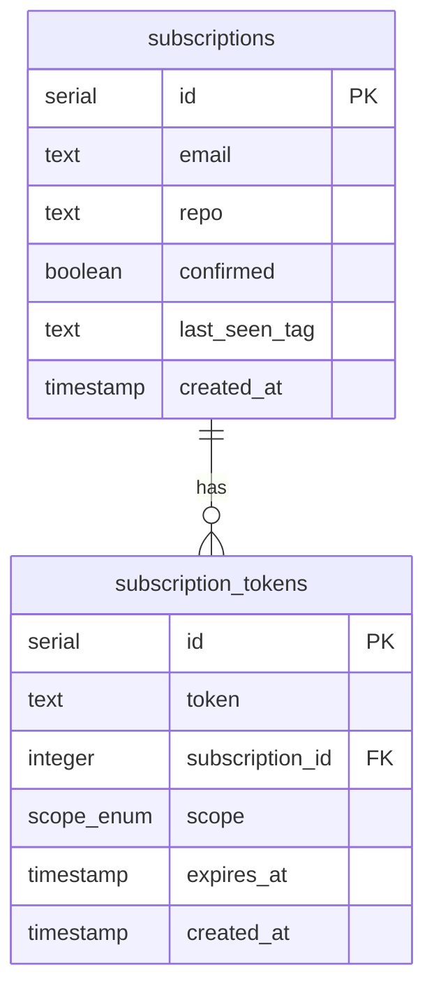

# GitHub Release Notification API

[](https://github.com/artemmatiushenko1/github-release-notifier/actions/workflows/ci.yaml)


A monolith service that allows users to subscribe to email notifications about new releases of any public GitHub repository.

## Features

- **Subscription Management**: Subscribe, confirm, and unsubscribe from repository release notifications.
- **Automated Scanning**: Periodically checks for new releases using a cron job.
- **Email Notifications**: Sends formatted emails when a new release is detected.
- **GitHub API Integration**: Validates repository existence and fetches the latest release data.
- **Caching**: Redis-based caching for GitHub API responses to respect rate limits (10-minute TTL).
- **Monitoring**: Prometheus metrics for tracking system health, scanner performance, and cache efficiency.
- **API Documentation**: Integrated Swagger UI for interactive API exploration.
- **Modern Tech Stack**: Built with Fastify, TypeScript, Drizzle ORM, and PostgreSQL.

## Client Application

The service includes a built-in React-based frontend to provide a user-friendly experience for managing subscriptions. When the server is running, you can access the following pages:

- **Subscription Page (`/`)**: The main landing page where users can enter their email and a GitHub repository path to subscribe.
- **Confirmation Page (`/confirm/:token`)**: The page users land on after clicking the link in their confirmation email to activate their subscription.
- **Unsubscribe Page (`/unsubscribe/:token`)**: A dedicated page for users to easily opt-out of notifications using their unique token.
- **Success Page (`/sent`)**: A feedback page shown after a successful subscription request, instructing the user to check their email.

## Business Logic

The service operates on two core processes: **Subscription Management** and **Automated Release Scanning**.

### 1. Subscription Lifecycle

- **Subscription Request**: Validates email and repository path (`owner/repo`). It checks repository existence via GitHub API and ensures no duplicate subscriptions exist. A pending subscription and secure tokens (confirm/unsubscribe) are created, and a confirmation email is sent.
- **Confirmation**: Upon clicking the link, the subscription becomes active, and an initial scan is triggered to capture the current `last_seen_tag`. This ensures users only receive notifications for _future_ releases.
- **Unsubscription**: Users can opt-out at any time using a unique token provided in every email.

### 2. Automated Release Scanning

- **Scheduled Scans**: A cron job (default: every 10 minutes) triggers the scanner for all confirmed subscriptions.
- **Change Detection**: The scanner fetches the latest release from GitHub and compares it with the `last_seen_tag` in the database.
- **Notification**: If a new tag is detected, the service sends an email to the subscriber and updates the `last_seen_tag` to prevent duplicate alerts.
- **Rate Limit Handling**: The service gracefully handles GitHub API rate limits (HTTP 429) and uses Redis caching to minimize redundant API calls.

## Tech Stack

- **Runtime**: Node.js (v22+)
- **Language**: TypeScript
- **Web Framework**: Fastify
- **Database**: PostgreSQL
- **ORM**: Drizzle ORM
- **Cache**: Redis (ioredis)
- **Validation**: Zod
- **Metrics**: Prometheus (prom-client)
- **Email**: Nodemailer
- **Testing**: Vitest
- **Scheduling**: node-cron
- **API Client**: Octokit

## Getting Started

### Prerequisites

- Docker and Docker Compose
- A GitHub Personal Access Token (optional, but recommended to avoid rate limits)
- A Gmail account with OAuth2 credentials (for sending emails)

### Environment Setup

1. Copy the example environment file:
   ```bash
   cp .env.example .env
   ```
2. Fill in the required variables in `.env`:
   - `DATABASE_URL`: PostgreSQL connection string.
   - `REDIS_URL`: Redis connection string.
   - `GITHUB_TOKEN`: Your GitHub PAT.
   - `GMAIL_USER_EMAIL`: Your Gmail address.
   - `GMAIL_CLIENT_ID`, `GMAIL_CLIENT_SECRET`, `GMAIL_REFRESH_TOKEN`: Your Google OAuth2 credentials.

### Running with Docker (Recommended)

**App stack only** (Postgres, Redis, Mailpit, API):

```bash
docker compose up --build
```

**App + monitoring** (Prometheus, Grafana, Elasticsearch, Kibana, Filebeat):

```bash
docker compose -f docker-compose.yaml -f monitoring/docker-compose.yaml up --build
```

See [monitoring/README.md](./monitoring/README.md) for the monitoring stack architecture, service URLs, and configuration.

Once the containers are running, the application will be accessible at:

- **Web Interface**: [http://localhost:3000](http://localhost:3000)
- **API Documentation (Swagger)**: [http://localhost:3000/api/docs](http://localhost:3000/api/docs)

The app container is not published to the host directly. **nginx** listens on port 3000 and proxies public traffic to the app. `/metrics` is blocked at the proxy and is only reachable on the internal Docker network (scraped by Prometheus).

### Running Locally

1. Install dependencies:
   ```bash
   npm install
   ```
2. Start the development server (requires local Postgres and Redis):
   ```bash
   npm run dev
   ```

## Observability

The API emits **structured JSON logs** (Pino) to stdout and exposes **Prometheus metrics** at `/metrics` on the internal network (HTTP RED plus business counters for notifications, scans, and cache hits). In Docker, nginx blocks public access to `/metrics`; only Prometheus scrapes it directly via `app:3000`.

Start the optional monitoring stack together with the app (see [monitoring/README.md](./monitoring/README.md)) to scrape metrics into Grafana and ship logs to Kibana.

When running locally with `npm run dev` (`NODE_ENV=development`), logs are automatically formatted for readability. Docker/production output stays JSON for Filebeat.

## Testing

The project includes a comprehensive test suite covering unit, integration, and end-to-end (E2E) scenarios.

### Unit & Integration Tests

These tests cover individual components and their interactions using **Vitest**. They utilize **PGlite** (a WASM-based in-memory PostgreSQL) to provide a real database environment with high performance and no external dependencies.

```bash
npm test
```

### End-to-End (E2E) Tests

E2E tests verify the complete user flow from the frontend to the backend using **Playwright**. The tests run in a fully containerized environment that includes:

- **Mailpit**: For capturing and verifying outgoing emails (confirmation/unsubscription links).
- **GitHub Mock Server**: For simulating repository states and avoiding API rate limits.
- **PostgreSQL & Redis**: Isolated instances specifically for the E2E suite.

#### Running E2E Tests (Recommended)

The simplest way to run E2E tests is via Docker Compose, which handles all dependencies and environment setup:

```bash
docker compose -f docker-compose.e2e.yaml up --build --exit-code-from e2e
```

#### Running E2E Tests Locally (for Debugging)

If you need to run tests locally with the Playwright UI:

1.  **Build the client**:
    ```bash
    npm run build --prefix client
    ```
2.  **Start the E2E infrastructure**:
    ```bash
    docker compose -f docker-compose.e2e.yaml up db redis github-mock mailpit -d
    ```
3.  **Run Playwright**:
    ```bash
    npm run test:e2e
    ```

## Project Structure

- `src/domain`: Core business logic and interfaces.
- `src/infrastructure`: Implementations of external services (DB, GitHub, Email, Metrics).
- `src/services`: Application services orchestrating domain logic.
- `src/routes`: API route definitions.
- `client/`: Frontend application code.
- `drizzle/`: Database migrations.
- `nginx/`: Public reverse proxy (blocks `/metrics` from the internet).
- `monitoring/`: Prometheus, Grafana, and ELK stack — see [monitoring/README.md](./monitoring/README.md).

## Database Schema

The service uses PostgreSQL with the following schema, managed by Drizzle ORM:


