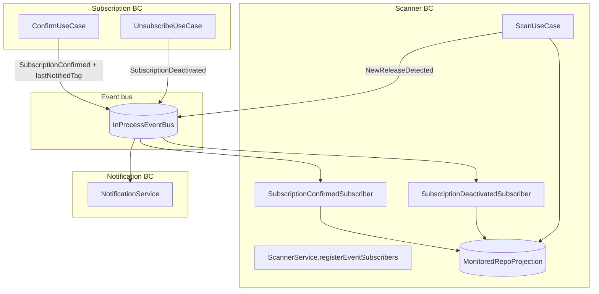

# MonitoredRepo projection — implementation plan

Scanner-owned, repo-centric read model that decouples release polling from the subscription module.

## Goals

- Scanner owns **what to poll** via a repo-centric read model (`MonitoredRepo`).
- Scanner no longer queries subscription BC on cron (`findAllConfirmedSubscriptions`).
- Subscription BC owns **lifecycle only** (subscribe / confirm / unsubscribe).
- Per-watcher `lastNotifiedTag`: silent ack at confirm (inline GitHub call), updated after each successful release email.
- Keep existing event-driven notification flow (`NewReleaseDetected` → email).

## Non-goals (this iteration)

- Outbox / message broker
- Removing `last_seen_tag` from `subscriptions` table immediately (can stay for API compat initially)
- Group-by-repo GitHub optimization beyond natural `MonitoredRepo` structure

---

## Target architecture



**Cron flow:**

```
ScanUseCase
  → MonitoredRepoProjection.findAll()
  → for each MonitoredRepo: one GitHub call
  → if latestTag ≠ repo.lastSeenTag: notify eligible watchers
  → after each successful email: watcher.lastNotifiedTag = latestTag
  → then repo.lastSeenTag = latestTag
```

---

## Domain model (scanner module)

### `MonitoredRepo` — one row per `owner/repo`

| Field         | Purpose                                             |
| ------------- | --------------------------------------------------- |
| `repo`        | `owner/repo` (PK)                                   |
| `lastSeenTag` | Latest release tag processed for this repo (cursor) |

### `RepoWatcher` — one subscriber watching a repo

| Field              | Purpose                                                                                       |
| ------------------ | --------------------------------------------------------------------------------------------- |
| `subscriptionId`   | Link back to subscription aggregate                                                           |
| `email`            | For notification payload                                                                      |
| `unsubscribeToken` | For notification payload                                                                      |
| `lastNotifiedTag`  | Per-watcher cursor — set at confirm (silent ack), updated after each successful release email |

**Lifecycle:**

1. **Confirm** — `ConfirmUseCase` fetches latest GitHub tag; scanner sets `lastNotifiedTag` to that tag (or `null` if no releases). No release email sent.
2. **Scan** — when `latestTag ≠ repo.lastSeenTag`, notify watchers where `latestTag ≠ watcher.lastNotifiedTag`.
3. **After successful email** — `watcher.lastNotifiedTag = latestTag`.
4. **After all eligible watchers processed** — `repo.lastSeenTag = latestTag`.

### Multiple subscriptions for the same repo

One `MonitoredRepo` for `golang/go`, multiple watchers:

| Watcher | lastNotifiedTag (silent ack at confirm) |
| ------- | --------------------------------------- |
| Alice   | v1.22                                   |
| Bob     | v1.25                                   |

When **v1.26** ships: one GitHub call, notify Alice and Bob, set each watcher’s `lastNotifiedTag = v1.26`, then `MonitoredRepo.lastSeenTag = v1.26`.

---

## Event contract changes

### 1. Extend `SubscriptionConfirmed` payload

```ts
{
  email: string;
  repo: string;
  unsubscribeToken: string;
  lastNotifiedTag: string | null; // silent ack: latest GitHub tag at confirm, or null if no releases
}
```

`ConfirmUseCase` fetches latest release **before publish**. Optionally still write to `subscriptions.last_seen_tag` for API compatibility.

### 2. Wire `SubscriptionDeactivated`

- `Subscription.unsubscribe()` → emit `SubscriptionDeactivatedEvent`
- `UnsubscribeUseCase` → publish after save
- Scanner removes watcher by `subscriptionId`

### 3. `NewReleaseDetected`

Unchanged; scanner publishes per watcher notified. Notification BC handles email.

---

## Implementation phases

### Phase 0 — Prerequisites

| Task                                                                   | Files / notes                                         |
| ---------------------------------------------------------------------- | ----------------------------------------------------- |
| Emit `SubscriptionDeactivated` from aggregate                          | `subscription/domain/subscription.ts`                 |
| Publish from `UnsubscribeUseCase`                                      | `unsubscribe.use-case.ts`, tests                      |
| Extend `ConfirmUseCase` with GitHub fetch + `lastNotifiedTag` in event | `confirm.use-case.ts`, mapper, `api/events.ts`, tests |
| Update integration tests for confirm                                   | `tests/integration/subscription.test.ts`              |

**Deliverable:** events complete; scanner can subscribe without changing cron yet.

---

### Phase 1 — `MonitoredRepo` projection

| Task         | Details                                                                                                                                          |
| ------------ | ------------------------------------------------------------------------------------------------------------------------------------------------ |
| Port         | `MonitoredRepoProjection` in `scanner/application/ports/` — `addWatcher`, `removeWatcher`, `findAll`, `updateLastSeenTag`, `markWatcherNotified` |
| Domain types | `MonitoredRepo`, `RepoWatcher` in `scanner/domain/`                                                                                              |
| Storage      | Postgres — `monitored_repos` + `repo_watchers` tables                                                                                            |
| Repository   | `DrizzleMonitoredRepoProjection` in `scanner/infrastructure/`                                                                                    |
| Bootstrap    | On app startup: seed from confirmed subscriptions if projection empty                                                                            |

**Schema sketch:**

```sql
CREATE TABLE monitored_repos (
  repo TEXT PRIMARY KEY,
  last_seen_tag TEXT
);

CREATE TABLE repo_watchers (
  subscription_id TEXT PRIMARY KEY,
  repo TEXT NOT NULL REFERENCES monitored_repos(repo) ON DELETE CASCADE,
  email TEXT NOT NULL,
  unsubscribe_token TEXT NOT NULL,
  last_notified_tag TEXT
);
```

---

### Phase 2 — Event subscribers (scanner)

Mirror `NotificationService.registerEventSubscribers`:

| Subscriber                          | On event                  | Action                                                                        |
| ----------------------------------- | ------------------------- | ----------------------------------------------------------------------------- |
| `SubscriptionConfirmedSubscriber`   | `SubscriptionConfirmed`   | Upsert `MonitoredRepo`, add `RepoWatcher` with `lastNotifiedTag` (silent ack) |
| `SubscriptionDeactivatedSubscriber` | `SubscriptionDeactivated` | Remove watcher; delete repo row if no watchers left                           |

New `**ScannerService**` class with `registerEventSubscribers(eventBus)`.

Wire in `AppContainer.registerEventSubscribers()` alongside notification.

**Suggested layout:**

```
scanner/
  domain/
    monitored-repo.ts
    repo-watcher.ts
  application/
    ports/
      monitored-repo-projection.ts
    scanner.service.ts
    subscribers/
      subscription-confirmed.subscriber.ts
      subscription-deactivated.subscriber.ts
  infrastructure/
    drizzle-monitored-repo-projection.ts
```

---

### Phase 3 — Refactor `ScanUseCase`

| Before                                                | After                                          |
| ----------------------------------------------------- | ---------------------------------------------- |
| `subscriptionQueries.findAllConfirmedSubscriptions()` | `monitoredRepoProjection.findAll()`            |
| Import `Subscription` aggregate                       | Work with `MonitoredRepo` + `RepoWatcher` DTOs |
| `observeNewRelease()` per sub                         | `updateLastSeenTag(repo, tag)` once per repo   |
| Loop per subscription                                 | Loop per repo → inner loop over watchers       |

**Notification logic:**

```ts
if (latestTag !== monitoredRepo.lastSeenTag) {
  for (const watcher of monitoredRepo.eligibleWatchers(latestTag)) {
    await eventBus.publish([{ type: NewReleaseDetected, ... }]);
    // in-process bus: publish completes when email subscriber succeeds
    await projection.markWatcherNotified(watcher.subscriptionId, latestTag);
  }
  await projection.updateLastSeenTag(repo, latestTag);
}
```

Remove `SubscriptionQueries` dependency from `ScanUseCase`.

---

### Phase 4 — Cleanup (optional follow-up)

| Item                          | Action                                                                                 |
| ----------------------------- | -------------------------------------------------------------------------------------- |
| `SubscriptionQueries`         | Remove if only used by scanner                                                         |
| `observeNewRelease`           | Remove                                                                                 |
| `Subscription.observeRelease` | Remove or keep only for API writes                                                     |
| `subscriptions.last_seen_tag` | Keep for swagger `GET /api/subscriptions`, populate at confirm or join from projection |
| README                        | Update “initial scan” → “silent ack at confirm”                                        |

---

## Dependency injection

```ts
registerEventSubscribers(): void {
  this.notificationService.registerEventSubscribers(this.eventBus);
  this.scannerService.registerEventSubscribers(this.eventBus);
}

// scanUseCase deps:
// monitoredRepoProjection, githubClient, logger, clock, metrics, eventBus
```

Startup order: `registerEventSubscribers()` → `build()` (unchanged).

---

## Testing plan

| Layer                  | Cases                                                                                                                     |
| ---------------------- | ------------------------------------------------------------------------------------------------------------------------- |
| Projection             | add/remove watcher; empty repo cleanup; update lastSeenTag                                                                |
| Confirmed subscriber   | creates repo + watcher; second watcher same repo                                                                          |
| Deactivated subscriber | removes watcher; removes repo when last watcher gone                                                                      |
| ScanUseCase            | one GitHub call per repo; notify only when tag changes; skip watcher already notified; update lastNotifiedTag after email |
| ConfirmUseCase         | sets lastNotifiedTag from GitHub (silent ack); null when no releases                                                      |
| Integration            | confirm → cron does not notify for current tag; new release after confirm → email                                         |

---

## E2E testing opportunities

Current e2e stack (`docker-compose.e2e.yaml` + Playwright):

- **UI flows** — subscribe, confirm, unsubscribe via browser (`tests/e2e/subscription.spec.ts`)
- **GitHub mock** — static latest release `v18.2.0` for `facebook/react` (`tests/e2e/mocks/github/`)
- **Mailpit** — real SMTP + HTTP API to read emails (`tests/e2e/utils/email.ts`)
- **Postgres** — tests can query/delete `subscriptions` directly
- **Scanner cron** — runs in the `api` container (`SCANNER_CRON=*/10 * * * `\*); not covered by e2e today

After `MonitoredRepo`, e2e becomes the best place to prove the **full pipeline**: confirm → projection updated → scan → email.

### Enablers (likely needed first)

| Enabler                    | Why                                                 | Options                                                                                                                                                   |
| -------------------------- | --------------------------------------------------- | --------------------------------------------------------------------------------------------------------------------------------------------------------- |
| **Trigger scan on demand** | Waiting 10 minutes for cron is impractical          | `POST /internal/test/scan` (test env only), or `SCANNER_CRON=* * * * `\* in e2e compose, or Playwright calls `scanUseCase.execute()` via a thin test hook |
| **Mutable GitHub mock**    | Need to simulate “new release appeared”             | `PUT /mock/releases/latest?tag=vX` on github-mock, or stateful in-memory tag the mock returns                                                             |
| **Projection DB access**   | Assert watcher rows without white-box unit tests    | Query `monitored_repos` / `repo_watchers` from e2e (same pattern as `db.delete(subscriptions)` today)                                                     |
| **Mailpit helpers**        | Assert release emails, not just confirm/unsubscribe | Extend `tests/e2e/utils/email.ts`: `getEmailBySubject()`, `waitForEmail()`, `assertNoEmail()`                                                             |

### High-value e2e scenarios

#### 1. Silent ack at confirm — no immediate release email

**Flow:** subscribe → confirm → check Mailpit

**Assert:**

- Welcome / confirmed email arrives (existing behaviour)
- **No** “New release” email for `v18.2.0` (lastNotifiedTag equals current mock tag)
- `repo_watchers.last_notified_tag = 'v18.2.0'` (or mock’s current tag)
- `monitored_repos.last_seen_tag` is null until first scan processes a newer tag

**Proves:** confirm-time silent ack + `MonitoredRepo` subscriber wiring.

---

#### 2. New release triggers notification

**Flow:** subscribe → confirm → bump mock tag to `v19.0.0` → trigger scan → check Mailpit

**Assert:**

- Release email to subscriber with tag `v19.0.0` and unsubscribe link
- `monitored_repos.last_seen_tag = 'v19.0.0'`
- Second scan with same mock tag → **no duplicate email**

**Proves:** cron scan loop, repo cursor, idempotent notify.

---

#### 3. Multiple subscribers, same repo

**Flow:** Alice and Bob both subscribe to `facebook/react`, both confirm → bump tag → scan

**Assert:**

- Both receive release email
- One `monitored_repos` row for `facebook/react`
- Two `repo_watchers` rows with different `subscription_id` / `email`
- Single GitHub API call per scan (optional: assert via mock request log)

**Proves:** repo-centric model + per-watcher notify.

---

#### 4. Late joiner — different lastNotifiedTag

**Flow:**

1. Alice confirms when mock returns `v18.2.0`
2. Bump mock to `v19.0.0`, scan → Alice gets email
3. Bob confirms when mock still returns `v19.0.0`
4. Scan again (no tag change)

**Assert:**

- Bob does **not** get a release email on step 4
- Bob’s `last_notified_tag = 'v19.0.0'`

1. Bump mock to `v20.0.0`, scan

**Assert:**

- Both Alice and Bob get email

**Proves:** `lastNotifiedTag` per watcher, not shared per-repo notify state.

---

#### 5. Unsubscribe removes watcher

**Flow:** subscribe → confirm → unsubscribe → bump tag → scan

**Assert:**

- No release email after unsubscribe
- `repo_watchers` row deleted for that `subscription_id`
- If last watcher: `monitored_repos` row deleted (or repo no longer returned by `findAll()`)

**Proves:** `SubscriptionDeactivated` subscriber + projection cleanup.

---

#### 6. Re-subscribe after unsubscribe

**Flow:** subscribe → confirm → unsubscribe → subscribe again → confirm → bump tag → scan

**Assert:**

- Watcher re-created in projection
- Release email delivered on new tag

**Proves:** full lifecycle through events, not stale projection state.

**Note:** overlaps existing UI test “re-subscribe after unsubscribing”; extend it with scan + mail assertion.

---

#### 7. Repo with no releases at confirm

**Flow:** mock returns `404` for `/releases/latest` on confirm → confirm succeeds → later mock returns `v1.0.0` → scan

**Assert:**

- `last_notified_tag` is null at confirm
- First scan after `v1.0.0` appears **notifies** (user opted in before any release existed)

**Proves:** edge case for confirm-time GitHub fetch with null silent ack.

---

#### 8. Bootstrap on startup (migration path)

**Flow:** insert confirmed subscription directly in DB (bypass projection) → restart `api` → trigger scan

**Assert:**

- Bootstrap populated `monitored_repos` / `repo_watchers`
- Scan behaves correctly without manual event replay

**Proves:** startup bootstrap for existing data (Phase 1 migration story).

---

### Suggested e2e structure

```
tests/e2e/
  subscription.spec.ts          # existing UI flows
  release-notification.spec.ts  # new: scan + mail scenarios
  utils/
    email.ts                    # extend for release subjects
    github-mock.ts              # bumpLatestReleaseTag(request, tag)
    scan.ts                     # triggerScan(request) → internal endpoint
    projection.ts               # getMonitoredRepo(db, repo), getWatchers(...)
  mocks/github/
    github-server.mock.ts       # add mutable release state + control endpoint
```

### Browser vs API e2e

| Style                                      | Best for                                        | Trade-off                                 |
| ------------------------------------------ | ----------------------------------------------- | ----------------------------------------- |
| **Browser** (current)                      | Confirm/unsubscribe link clicks, UI regressions | Slower; great for user-facing flows       |
| **API** (`request.post('/api/subscribe')`) | Scan/notify scenarios with many setup steps     | Faster; skips UI unless testing links     |
| **Hybrid**                                 | API subscribe + Mailpit confirm link in browser | Balance of speed and realistic token flow |

Recommendation: keep subscription UI tests as-is; add `**release-notification.spec.ts`** using **API + Mailpit + scan trigger\*\* for scanner/projection coverage. Use browser only where token links matter.

### What not to e2e (keep in integration/unit)

- GitHub rate-limit handling (`429`) — unit test with mocked client
- Event bus handler failure isolation — unit test
- Projection CRUD edge cases — unit/integration with in-memory or test DB
- Prometheus metrics — optional smoke, not business-critical path

### CI considerations

- Mutable mock + scan trigger keeps new tests **deterministic** (no `sleep(600000)`)
- Reuse existing `docker compose -f docker-compose.e2e.yaml up --exit-code-from e2e` job
- Clean up `monitored_repos` / `repo_watchers` in `afterEach` alongside `subscriptions`
- Consider separate `describe('Release notifications')` with longer timeout only for multi-step scan tests

---

## Migration / bootstrap

Existing confirmed subscriptions need projection rows before first cron.

**Recommended:** startup bootstrap — group confirmed subs by repo, insert watchers + `lastNotifiedTag` from `subscriptions.last_seen_tag` (or fetch GitHub if null).

**Alternative:** one-off SQL migration from `subscriptions WHERE status = 'confirmed'`.

---

## Open questions

1. **Storage:** Postgres tables (recommended) vs in-memory first? Assignment requires DB persistence.
2. **`subscriptions.last_seen_tag`:** Keep column and sync from projection for swagger, or derive at read time from `repo_watchers.last_notified_tag` / `monitored_repos.last_seen_tag`?
3. **Partial notify failure:** If email fails for one watcher but others succeed, only advance `lastNotifiedTag` for successful watchers; defer `repo.lastSeenTag` until all eligible watchers are notified (or document best-effort).
4. **Confirm failure:** If GitHub is down at confirm, fail the request or confirm with `lastNotifiedTag: null` and let first scan notify on first release?
5. **Naming:** `ScannerService` vs `MonitoredRepoService` for the class that registers subscribers?

---

## Suggested PR split

1. **PR 1:** `SubscriptionDeactivated` + confirm `lastNotifiedTag` (Phase 0)
2. **PR 2:** DB schema + projection + subscribers (Phases 1–2)
3. **PR 3:** `ScanUseCase` refactor + remove scanner → subscription coupling (Phase 3)
4. **PR 4:** Cleanup + README (Phase 4)

---

## Summary

| Concern                           | Owner                                                                      |
| --------------------------------- | -------------------------------------------------------------------------- |
| Subscribe / confirm / unsubscribe | Subscription BC                                                            |
| Who watches which repo            | Scanner `MonitoredRepo` projection                                         |
| Repo release cursor               | `MonitoredRepo.lastSeenTag`                                                |
| Per-user release cursor           | `RepoWatcher.lastNotifiedTag` (silent ack at confirm, updated after email) |
| Send email                        | Notification BC (unchanged)                                                |
