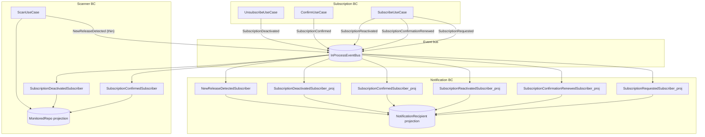

# Notification recipient projection — implementation plan

**Status:** Approved. See also [monitored-repo-plan.md](./monitored-repo-plan.md) for the scanner-side projection.

## Problem

[`RepoWatcher`](../src/modules/scanner/domain/repo-watcher.ts) currently stores `email`, `unsubscribeToken`, and `lastNotifiedTag`. Scanner only needs **who to poll** and **per-watcher release cursors**; email and unsubscribe links are notification concerns.

Today [`ScanUseCase`](../src/modules/scanner/application/scan.use-case.ts) builds a fat `NewReleaseDetected` payload from watcher fields, duplicating subscription data in `repo_watchers`.

## Goals

- Scanner owns: `repo`, `subscriptionId`, `lastNotifiedTag`, repo `lastSeenTag`
- Notification owns: `subscriptionId` → `email`, `unsubscribeToken` (delivery projection)
- `NewReleaseDetected` carries release metadata + `subscriptionId` only
- Recipient row upserted on all subscribe-path events (`SubscriptionRequested`, `SubscriptionConfirmationRenewed`, `SubscriptionReactivated`); unsubscribe token set on **confirm**
- Confirm/welcome emails keep using event payload directly (no lookup)

## Non-goals

- Outbox / message broker
- Changing subscription aggregate or public API contracts
- Projection for confirm-link emails (`Requested`, `ConfirmationRenewed`, `Reactivated`)

---

## Target architecture



**Release notify flow:**

```
ScanUseCase
  → eligibleWatchers (subscriptionId + lastNotifiedTag only)
  → publish NewReleaseDetected { subscriptionId, repo, tag, releaseName }
  → notification looks up recipient → send email
  → markWatcherNotified + markReleaseSeen + save (unchanged order)
```

---

## Domain model (notification module)

### `NotificationRecipient` — one row per subscription

| Field              | Purpose                                                |
| ------------------ | ------------------------------------------------------ |
| `subscriptionId`   | PK, link to subscription aggregate                     |
| `email`            | Delivery address (set at subscribe)                    |
| `unsubscribeToken` | Nullable until confirm; required before release emails |

**Lifecycle:**

1. **Subscribe paths** — upsert `email` from any of:
   - `SubscriptionRequested` (new subscription)
   - `SubscriptionConfirmationRenewed` (pending token renewed)
   - `SubscriptionReactivated` (unsubscribed user re-subscribes)

   All three use `aggregateId` + `payload.email`. Upsert preserves existing `unsubscribeToken` if the row already exists (e.g. edge replay); token is only cleared implicitly when row is deleted on deactivate.

2. **Confirm** — set `unsubscribeToken` from `SubscriptionConfirmed` (welcome email still sent from event payload by existing [`SubscriptionConfirmedSubscriber`](../src/modules/notification/application/subscribers/subscription-confirmed.subscriber.ts))

3. **Deactivate** — delete row on `SubscriptionDeactivated`

4. **Release** — `NewReleaseDetectedSubscriber` loads by `subscriptionId`; if missing or token null, log error and **throw** so publish fails and scanner cursors do not advance (current publish-before-mark order in `ScanUseCase` preserves this)

---

## Domain model (scanner module) — slim down

### `RepoWatcher` (after)

| Field             | Purpose                    |
| ----------------- | -------------------------- |
| `subscriptionId`  | Link to subscription       |
| `lastNotifiedTag` | Per-watcher release cursor |

Remove `email`, `unsubscribeToken`, and `Email` import from scanner domain.

### Thin `NewReleaseDetected` event

Update [`src/modules/scanner/api/events.ts`](../src/modules/scanner/api/events.ts):

```ts
{
  repo: string;
  tag: string;
  releaseName: string;
  // email + unsubscribeToken removed
}
```

`aggregateId` remains `subscriptionId` (no payload duplication).

---

## Database schema

**New table** `notification_recipients`:

```sql
CREATE TABLE notification_recipients (
  subscription_id TEXT PRIMARY KEY NOT NULL,
  email TEXT NOT NULL,
  unsubscribe_token TEXT
);
```

**Migration** `0009_notification_recipients.sql`:

- Create `notification_recipients`
- Backfill from `repo_watchers` (`subscription_id`, `email`, `unsubscribe_token`)
- Drop `email`, `unsubscribe_token` from `repo_watchers`

Update [`src/platform/db/schema.ts`](../src/platform/db/schema.ts) accordingly.

---

## Implementation phases

### Phase 1 — Notification projection (new)

| Task                   | Details                                                                                                                                                                                                |
| ---------------------- | ------------------------------------------------------------------------------------------------------------------------------------------------------------------------------------------------------ |
| Domain                 | `NotificationRecipient` in `notification/domain/` (minimal; email as `Email` VO from shared-kernel)                                                                                                    |
| Port                   | `NotificationRecipientRepository` — `findBySubscriptionId`, `save`, `delete`                                                                                                                           |
| Infrastructure         | `DrizzleNotificationRecipientRepository` + row mapper                                                                                                                                                  |
| Projection subscribers | New handlers in `notification/application/subscribers/projection/`                                                                                                                                     |
| Wire                   | Extend [`notification-event-subscribers.ts`](../src/modules/notification/application/notification-event-subscribers.ts) to register projection subscribers **before** email subscribers on same events |

### Phase 2 — Slim scanner projection

| Task                                           | Details                                               |
| ---------------------------------------------- | ----------------------------------------------------- |
| `RepoWatcher`                                  | Remove `email`, `unsubscribeToken`                    |
| Scanner `subscription-confirmed.subscriber.ts` | Only pass `subscriptionId` + `lastNotifiedTag`        |
| Mapper / repository                            | Stop reading/writing email columns on `repo_watchers` |
| Migration                                      | `0009_*` as above                                     |

### Phase 3 — Thin release event + lookup

| Task                                 | Details                                                                                                |
| ------------------------------------ | ------------------------------------------------------------------------------------------------------ |
| `scan.use-case.ts`                   | Publish thin payload (no `watcher.email` / `watcher.unsubscribeToken`)                                 |
| `new-release-detected.subscriber.ts` | Inject `NotificationRecipientRepository`; lookup by `event.aggregateId`                                |
| Error handling                       | `RecipientNotFoundError` / `UnsubscribeTokenNotSetError`; throw so failed lookup blocks cursor advance |

### Phase 4 — Tests and cleanup

| Layer                          | Cases                                                                                 |
| ------------------------------ | ------------------------------------------------------------------------------------- |
| Projection repo                | save, find, delete; nullable token until confirm                                      |
| Projection subscribers         | requested/renewed/reactivated upsert email; confirmed sets token; deactivated deletes |
| Scanner                        | watcher slimmed; confirmed subscriber no longer stores email                          |
| `NewReleaseDetectedSubscriber` | sends using projection; fails when recipient missing                                  |
| `ScanUseCase`                  | event payload no longer includes email/token                                          |
| Integration                    | migration backfill; end-to-end confirm → scan                                         |

Update [`monitored-repo-plan.md`](./monitored-repo-plan.md) summary table: remove email/token from `RepoWatcher`; cross-link to this plan.

---

## Event handler ordering note

Multiple handlers subscribe to the same event type on [`InProcessEventBus`](../src/platform/event-bus/in-process-event-bus.ts) (sequential per handler). For `SubscriptionConfirmed`:

1. Notification projection subscriber — set `unsubscribeToken`
2. Notification email subscriber — send welcome email (event payload)
3. Scanner projection subscriber — add watcher with `lastNotifiedTag`

Register projection handlers before email/scanner handlers in `register()`.

---

## Decisions

1. **Re-subscribe events (resolved):** Upsert `email` on all three subscribe-path events — `SubscriptionRequested`, `SubscriptionConfirmationRenewed`, and `SubscriptionReactivated` — not only on initial subscribe.

## Open questions

1. **Bootstrap:** One-off SQL backfill in migration is enough for dev; optional startup bootstrap if projection empty (same story as scanner).
2. **Batch publish:** Current scan publishes all `NewReleaseDetected` events then marks all watchers — if one recipient lookup fails mid-batch, earlier emails may have sent. Accept for now.

---

## Suggested PR split

1. **PR 1:** `notification_recipients` table + notification projection subscribers (Phase 1)
2. **PR 2:** Slim `repo_watchers` + scanner changes (Phase 2)
3. **PR 3:** Thin `NewReleaseDetected` + subscriber lookup (Phase 3)
4. **PR 4:** Tests, docs, monitored-repo-plan cross-links (Phase 4)

---

## Summary

| Concern                         | Owner                                                                   |
| ------------------------------- | ----------------------------------------------------------------------- |
| What repos to poll              | Scanner `MonitoredRepo`                                                 |
| Release cursors                 | Scanner `lastSeenTag` + `lastNotifiedTag`                               |
| Who to email / unsubscribe link | Notification `NotificationRecipient`                                    |
| Subscribe / confirm lifecycle   | Subscription BC (events only)                                           |
| Send email                      | Notification BC (lookup for release; event payload for confirm/welcome) |
