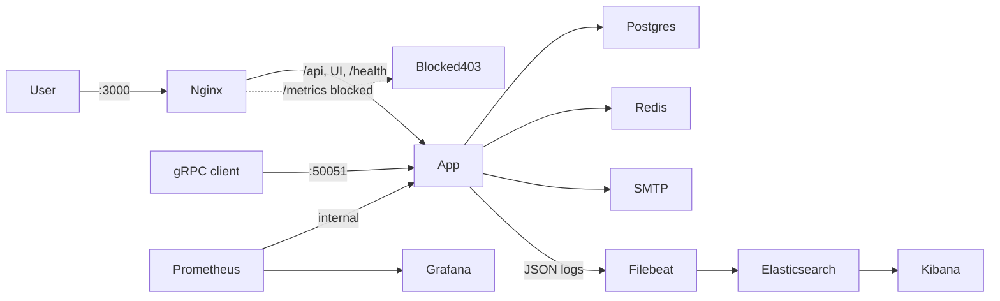
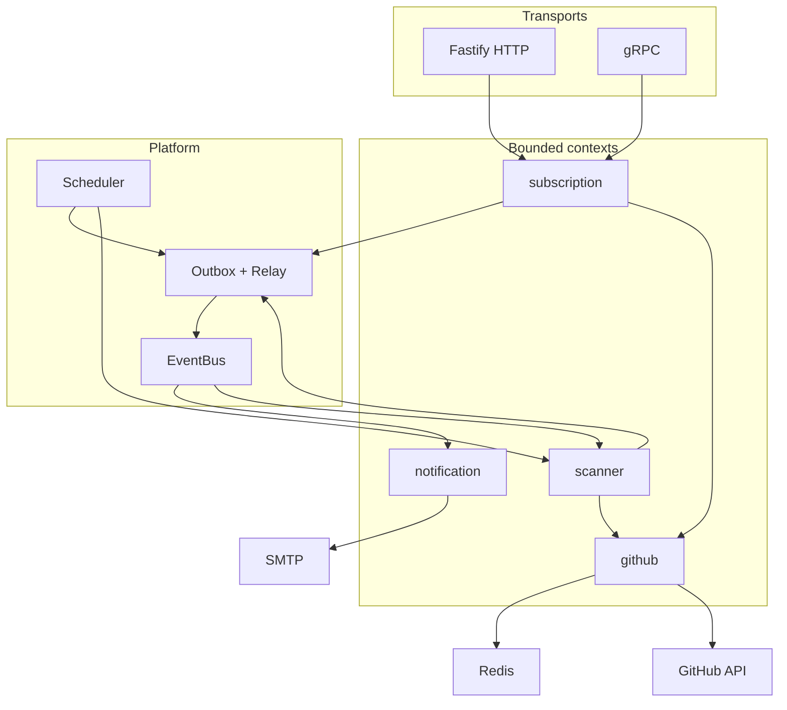
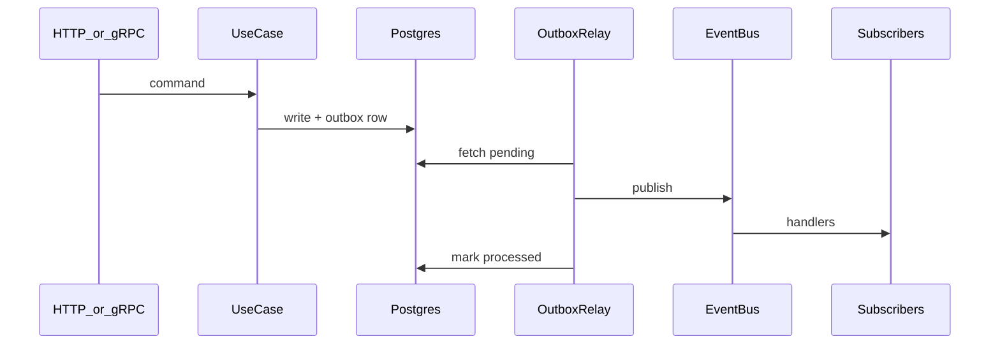
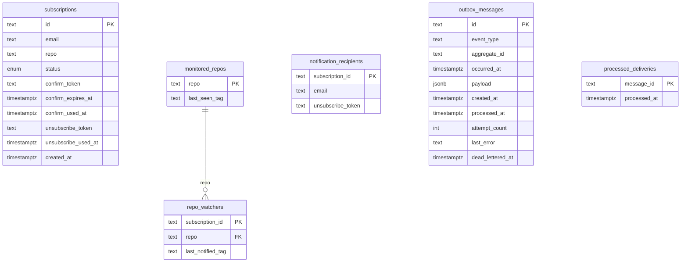

# Software Design Document

GitHub Release Notifier is a **modular monolith**: one Node.js process that manages subscription lifecycle, scans GitHub for new releases, and sends email notifications.

## Deployment

- HTTP and the React UI go through **nginx** on port 3000; `/metrics` is blocked publicly.
- **gRPC** is exposed directly on port 50051.
- Optional monitoring stack: see [monitoring/README.md](../monitoring/README.md).

## Application architecture

Composition root: [`src/dependencies.ts`](../src/dependencies.ts) → [`src/app.ts`](../src/app.ts) → [`src/index.ts`](../src/index.ts).

## Bounded contexts

| Module           | Responsibility                        | Schema                                             |
| ---------------- | ------------------------------------- | -------------------------------------------------- |
| **subscription** | Subscribe, confirm, unsubscribe, list | `subscription.subscriptions`                       |
| **scanner**      | Repo-centric release scanning         | `scanner.monitored_repos`, `scanner.repo_watchers` |
| **notification** | Email templates and delivery          | `notification.notification_recipients`             |
| **github**       | Octokit client + Redis cache          | —                                                  |

Each module lives under `src/modules/<context>/` with `api/`, `application/`, `domain/`, `infrastructure/`. Cross-module imports go through `api/` only.

## Integration events

Use cases persist domain state and outbox rows in the **same transaction**. `OutboxRelay` polls pending messages and publishes to the in-process `EventBus`.

| Event                             | Publisher    | Consumers             |
| --------------------------------- | ------------ | --------------------- |
| `SubscriptionRequested`           | subscription | notification          |
| `SubscriptionConfirmationRenewed` | subscription | notification          |
| `SubscriptionReactivated`         | subscription | notification          |
| `SubscriptionConfirmed`           | subscription | notification, scanner |
| `SubscriptionDeactivated`         | subscription | notification, scanner |
| `NewReleaseDetected`              | scanner      | notification          |

Subscribers are idempotent (`platform.processed_deliveries`). Background jobs: scanner cron (`SCANNER_CRON`) and outbox relay (`OUTBOX_RELAY_CRON`).

## Data model

PostgreSQL uses separate schemas per context. `subscriptionId` links across schemas logically — no cross-schema FKs.

## APIs

**REST** (via nginx `:3000`):

| Method | Path                        | Operation      |
| ------ | --------------------------- | -------------- |
| POST   | `/api/subscribe`            | Subscribe      |
| GET    | `/api/confirm/:token`       | Confirm        |
| GET    | `/api/unsubscribe/:token`   | Unsubscribe    |
| GET    | `/api/subscriptions?email=` | List confirmed |

**gRPC** (`:50051`): `Subscribe`, `Confirm`, `Unsubscribe`, `ListSubscriptions` — same use cases as REST. Proto: [`subscription.proto`](../src/modules/subscription/api/subscription.proto).

## Quality attributes

| Attribute           | Approach                                                                                                                                                                                                    |
| ------------------- | ----------------------------------------------------------------------------------------------------------------------------------------------------------------------------------------------------------- |
| **Reliability**     | Transactional outbox — domain writes and events are atomic. At-least-once delivery with idempotent subscribers (`processed_deliveries`). Dead-lettering after `OUTBOX_MAX_RETRIES`.                         |
| **Performance**     | Repo-centric scanning (one GitHub API call per repo). Redis cache for GitHub responses (`GITHUB_CACHE_TTL`).                                                                                                |
| **Operability**     | Structured JSON logs (Pino), HTTP RED metrics, business counters, outbox metrics. Optional Prometheus/Grafana/ELK stack. See [ADR-0003](./adr/0003-observability-stack.md).                                 |
| **Maintainability** | Bounded contexts with `api/` import boundaries. Architecture tests in `tests/architecture/`. ADRs for major decisions.                                                                                      |
| **Testability**     | DI via `AppContainer`; injectable clock, scheduler, and clients. Test pyramid: static → unit → integration (PGlite) → E2E (Docker + Playwright). See [ADR-0001](./adr/0001-functional-testing-strategy.md). |
| **Security**        | `/metrics` blocked at nginx. gRPC uses insecure credentials (no TLS) — not suitable for untrusted networks as-is.                                                                                           |

## Architecture decisions

Detailed rationale lives in [ADR index](./adr/README.md).
