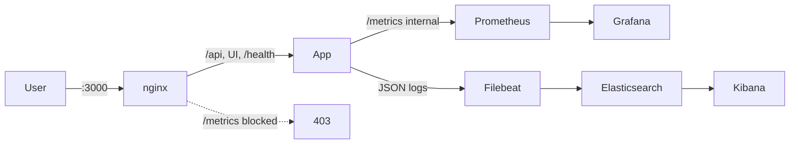

# Monitoring stack

Prometheus, Grafana, and the ELK logging pipeline (Elasticsearch, Kibana, Filebeat).

This stack collects application metrics and structured logs so we can observe request rates, errors, latency, and business events in Grafana and search or filter app logs in Kibana.

## Architecture



> **Important:** Run all commands from the **repository root**. Volume paths in `docker-compose.yaml` here are relative to the project root (e.g. `./monitoring/prometheus/...`), not this folder.

## Start

Run together with the app stack so Prometheus can reach `app:3000` on the shared Docker network:

```bash
docker compose -f docker-compose.yaml -f monitoring/docker-compose.yaml up --build
```

## Environment variables

See `.env.example` in the repository root:

- `GRAFANA_ADMIN_USER`, `GRAFANA_ADMIN_PASSWORD` — Grafana login
- `ELASTIC_PASSWORD` — Elasticsearch superuser (`elastic`)
- `KIBANA_SYSTEM_PASSWORD` — internal Kibana → Elasticsearch connection
- `KIBANA_ENCRYPTION_KEY` — Kibana saved-object encryption (min 32 characters)

## URLs

| Service       | URL                   |
| ------------- | --------------------- |
| Prometheus    | http://localhost:9090 |
| Grafana       | http://localhost:3001 |
| Elasticsearch | http://localhost:9200 |
| Kibana        | http://localhost:5601 |

Grafana default login: `admin` / `admin` (override via env vars above).  
Kibana login: `elastic` / value of `ELASTIC_PASSWORD`.
